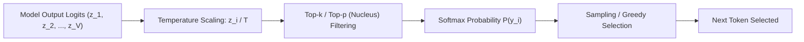
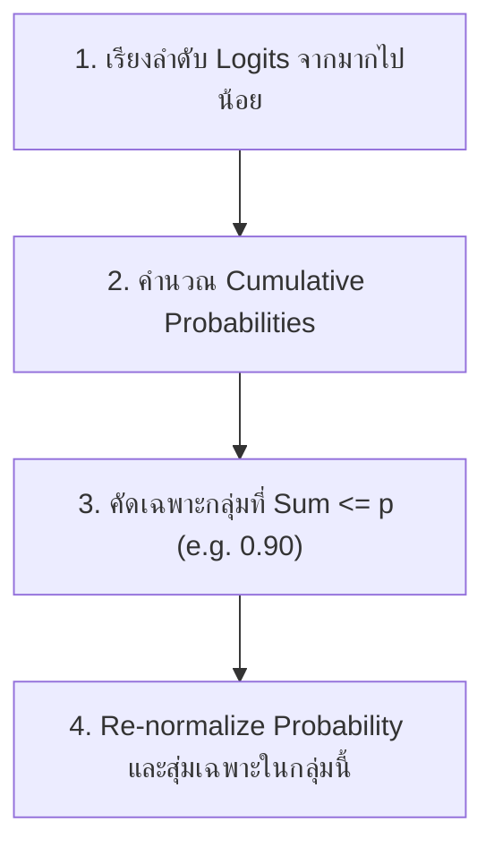

# 🎲 03.1 - Decoding Strategies (Greedy, Sampling, Top-k, Top-p, Temperature)

> [!NOTE]
> ในขั้นตอน **Inference (การสร้างข้อความ)** LLM จะส่งค่า Logits (Unnormalized Scores) ขนาดเท่ากับ Vocabulary ($V$) ออกมา เทคนิค **Decoding Strategy** คืออัลกอริทึมที่กำหนดวิธีการเลือกโทเคนถัดไปจาก Logits เหล่านั้น

---

## 🧭 1. กระบวนการประมวลผล Logits สู่ Probability

---

## 🎛️ 2. พารามิเตอร์การสุ่มคำตอบที่ต้องจำสำหรับสอบ

### 2.1 Temperature ($T$)
ปรับแต่งระดับความชันของ Softmax Distribution:
$$P(y_i) = \frac{\exp(z_i / T)}{\sum_{j=1}^{V} \exp(z_j / T)}$$

- **$T \to 0$ (Low Temperature, e.g. 0.0 - 0.2)**:
  - ทำให้ค่าความน่าจะเป็นอันดับ 1 สูงเด่นขึ้นมาโดดๆ
  - พฤติกรรมกลายเป็น **Deterministic** เหมาะกับงานคณิตศาสตร์ โค้ดคอมพิวเตอร์ หรือข้อเท็จจริง
- **$T = 1.0$**: ค่าความน่าจะเป็นมาตรฐานจากโมเดล
- **$T > 1.0$ (High Temperature, e.g. 1.2 - 1.5)**:
  - เกลี่ยความน่าจะเป็นให้แบนลง (Flatter Distribution) เพิ่มโอกาสเลือกโทเคนที่ความน่าจะเป็นต่ำ
  - เพิ่มความหลากหลายและจินตนาการ เหมาะกับงานเขียนสร้างสรรค์ (Creative Writing) แต่เสี่ยงต่อการเกิด **Hallucination**

### 2.2 Greedy Search vs Random Sampling
- **Greedy Search**: เลือกโทเคนที่มีความน่าจะเป็นสูงสุดเสมอ ($y = \arg\max P(y_i)$)
  - **จุดอ่อน**: มักเกิดปัญหาพูดซ้ำซ้อน (Repetition Loops) หรือติดใน Local Optima
- **Random Sampling**: สุ่มเลือกโทเคนตามถ่วงน้ำหนักความน่าจะเป็น $P(y_i)$

### 2.3 Top-k Sampling
- จำกัดการสุ่มให้อยู่เฉพาะ **Top $k$ โทเคนแรก** ที่มีความน่าจะเป็นสูงสุดเท่านั้น แล้วตัดโทเหน้าที่เหลือทิ้ง
- **ข้อเสีย**: ค่า $k$ เป็นค่าคงที่ ถ้าบริบทเปิดกว้าง $k=50$ อาจน้อยไป แต่ถ้าบริบทแคบชัดเจน $k=50$ อาจดึงโทเคนขยะเข้ามา

### 2.4 Top-p Sampling (Nucleus Sampling)
- เสนอโดย Holtzman et al. (2019) ใช้คัดเลือกกลุ่มโทเคนที่ผลรวมความน่าจะเป็นสะสม (Cumulative Probability) เกินค่า $p$ (เช่น $p = 0.9$)

>[!EXAMPLE]
> **คำนวณข้อสอบ Top-p (Nucleus) Step-by-Step**:
> สมมติเรียงลำดับความน่าจะเป็นของ Vocab ได้ดังนี้:
> - คำว่า A ($P=0.45$)
> - คำว่า B ($P=0.30$)
> - คำว่า C ($P=0.15$)
> - คำว่า D ($P=0.08$)
> - คำว่า E ($P=0.02$)
> 
> หากตั้งค่า **Top-p = 0.85**:
> 1. $P(A) = 0.45$ (สะสม = 0.45 $\le 0.85$) $\to$ **เอา**
> 2. $P(A) + P(B) = 0.45 + 0.30 = 0.75$ (สะสม = 0.75 $\le 0.85$) $\to$ **เอา**
> 3. $P(A) + P(B) + P(C) = 0.75 + 0.15 = 0.90$ (สะสม = 0.90 $> 0.85$ เกินจุดวิกฤต) $\to$ **เอา C เป็นตัวสุดท้าย!**
> 4. **ผลลัพธ์**: คัดเลือกเฉพาะ `{A, B, C}` มา Re-normalize ความน่าจะเป็น แล้วสุ่ม!

---

## 🔎 3. Beam Search

- รักษาเส้นทางการค้นหาไว้ $B$ เส้นทาง (Beam Width) พร้อมกันในทุกๆ Step
- เหมาะสำหรับงานประเภท Machine Translation หรือ Text Summarization ขนาดสั้น
- **ไม่นิยมใน LLM Chatbot** เนื่องจากกินทรัพยากรคำนวณมหาศาลและลดความเป็นธรรมชาติของภาษา

---

## 🔗 ลิงก์เชื่อมโยงใน Obsidian Wiki
- ก่อนหน้า: [[02.1 - Pre-training & Loss Functions]]
- เทคนิคเร่งความเร็ว Inference: [[03.3 - KV Cache, FlashAttention & Speculative Decoding]]
- ควอนไทซ์โมเดล: [[03.2 - Quantization (GGUF, AWQ, GPTQ, INT8, INT4)]]
