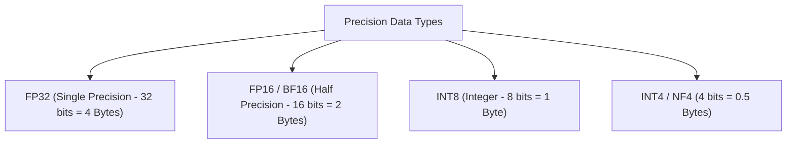
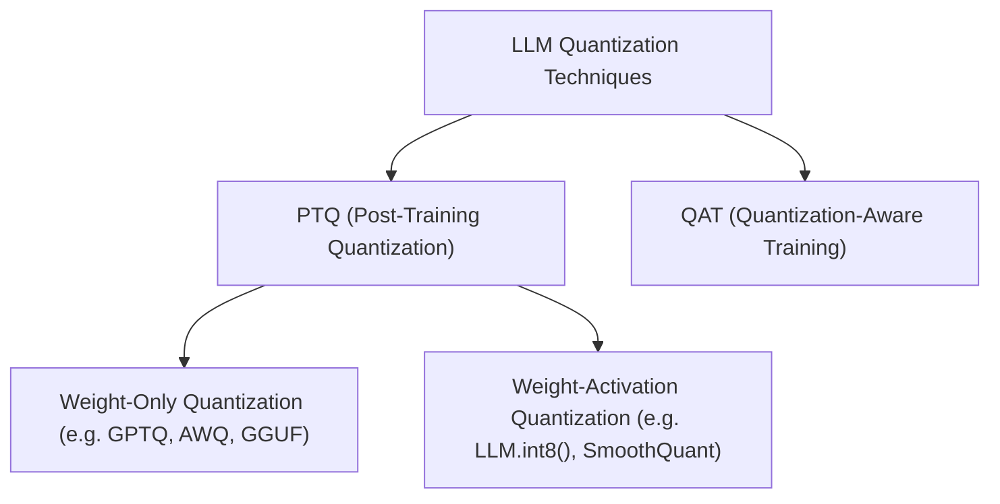

# ⚙️ 03.2 - Quantization (GGUF, AWQ, GPTQ, INT8, INT4)

> [!NOTE]
> **Quantization (การควอนไทซ์)** คือกระบวนการลดความละเอียดการจัดเก็บตัวเลขพารามิเตอร์จาก Floating Point ความละเอียดสูง (เช่น FP16 16-bit) ลงมาเป็นตัวเลขจำนวนเต็มความละเอียดต่ำ (เช่น INT8 8-bit หรือ INT4 4-bit) เพื่อลดขนาดหน่วยความจำ VRAM และเพิ่มความเร็วในการ Inference บน Hardware ทั่วไป

---

## 🔢 1. ชนิดของชนิดข้อมูล (Data Types Representation)

- **FP16 vs BF16**: BF16 (Bfloat16) มี Dynamic Range เท่ากับ FP32 (8 Exponent bits) ป้องกันปัญหา Overflow/Underflow ในการเทรนได้ดีกว่า FP16 (5 Exponent bits)

---

## 📐 2. สูตรคณิตศาสตร์การ Quantization (Symmetric vs Asymmetric)

การแปลงค่าตัวเลขทศนิยมจริง $x \in [\alpha, \beta]$ ลงสู่ช่วงจำนวนเต็ม $q \in [q_{\min}, q_{\max}]$:

$$q = \text{round}\left( \frac{x}{S} \right) + Z$$
$$x_{\text{dequantized}} = S \cdot (q - Z)$$

โดยที่:
- $S$ คือ **Scale Factor**: $S = \frac{\beta - \alpha}{q_{\max} - q_{\min}}$
- $Z$ คือ **Zero-Point**: ค่าจำนวนเต็มที่ตรงกับค่า $0.0$ ในทศนิยมจริง

---

## 🛠️ 3. เทคนิค Quantization ยอดฮิตที่ต้องจำสำหรับสอบ

### 3.1 PTQ vs QAT
- **PTQ (Post-Training Quantization)**: ควอนไทซ์โมเดลหลังจากเทรนเสร็จแล้ว สะดวกรวดเร็ว ไม่ต้องเทรนใหม่
- **QAT (Quantization-Aware Training)**: จำลองผลของ Quantization ในระหว่างการเทรน ทำให้โมเดลปรับตัวได้ดีกว่า แต่ใช้ทรัพยากรเทรนสูง

### 3.2 GPTQ (Generalized Post-Training Quantization)
- เป็น One-shot Weight Quantization อิงจาก **Hessian Matrix (Second-order Derivatives)**
- ควอนไทซ์น้ำหนักลงเป็น INT4/INT3 ทีละ Column และชดเชย Error ไปยังน้ำหนักคอลัมน์ที่เหลือ
- **จุดเด่น**: เหมาะสำหรับรันบน GPU (Nvidia Tensor Cores)

### 3.3 AWQ (Activation-aware Weight Quantization)
- สังเกตว่า **ไม่ใช่ทุกพารามิเตอร์ที่มีความสำคัญเท่ากัน!**
- AWQ ปกป้องเฉพาะพารามิเตอร์ 1% ที่ตรงกับค่า **Outlier Activations** สูงๆ ให้คงความละเอียดไว้ ส่วน 99% ที่เหลือควอนไทซ์ลงเป็น INT4
- **ผลลัพธ์**: ให้ความแม่นยำสูงกว่า GPTQ ในสเกลโมเดลขนาดเล็กถึงปานกลาง

### 3.4 GGUF (llama.cpp Format)
- ฟอร์แมตไฟล์เดี่ยวแบบไบนารี ปรับปรุงมาจาก GGML
- ออกแบบมาสำหรับการ Inference บน **CPU และ Apple Silicon (Metal API)** รวมถึงสลับโหลดบาง Layer ไป GPU (GPU Offloading)
- มีระดับ Quantizations หลากหลาย: `Q4_K_M`, `Q5_K_M`, `Q8_0`

---

## 📊 4. ตารางเปรียบเทียบ VRAM และ Loss ประสิทธิภาพ

| Format / Precision | Bits per Weight | ขนาดโมเดล 7B | คุณภาพความแม่นยำ | Hardware เหมาะสม |
| :--- | :--- | :--- | :--- | :--- |
| **FP16 / BF16** | 16 bits | ~14.0 GB | 100% (Baseline) | High-end Data Center GPUs |
| **INT8 (LLM.int8)** | 8 bits | ~7.0 GB | >99.5% | Mid-range GPUs |
| **INT4 (AWQ / GPTQ)**| 4 bits | ~3.5 GB | ~97-99% | Consumer GPUs (RTX 3060/4060) |
| **GGUF (Q4_K_M)** | ~4.5 bits | ~4.1 GB | ~98% | CPU / Mac M1/M2/M3/M4 |

---

## 🔗 ลิงก์เชื่อมโยงใน Obsidian Wiki
- ก่อนหน้า: [[03.1 - Decoding Strategies (Greedy, Sampling, Top-k, Top-p, Temperature)]]
- เทคนิค QLoRA: [[02.4 - Parameter-Efficient Fine-Tuning (LoRA, QLoRA, Prefix Tuning)]]
- ความเร็วและ Memory Bottleneck: [[03.3 - KV Cache, FlashAttention & Speculative Decoding]]
