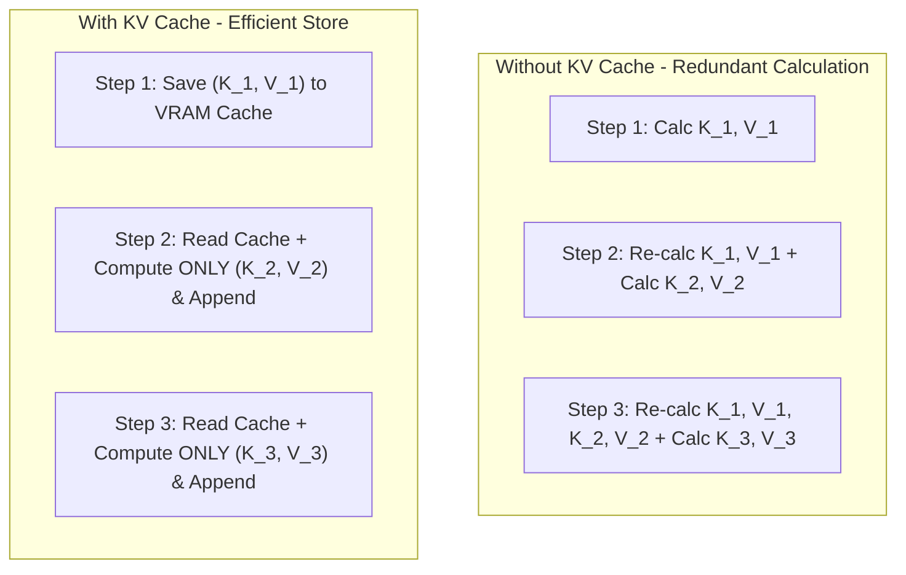
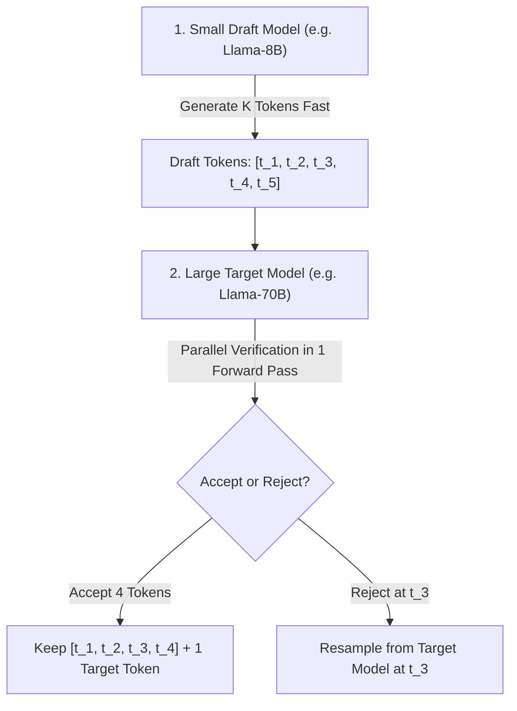

# ⚡ 03.3 - KV Cache, FlashAttention & Speculative Decoding

> [!NOTE]
> ในการใช้งานจริง ปัญหาคอขวดของการ Inference LLM ไม่ได้อยู่ที่ความเร็วในการคำนวณของ GPU (Compute-bound) แต่อยู่ที่ **ความเร็วการรับส่งข้อมูลผ่านหน่วยความจำ GPU Memory Bandwidth (Memory-bound)** บทนี้อธิบาย 3 เทคโนโลยีปฏิวัติวงการที่ช่วยเร่งความเร็ว LLM ขึ้น 2-10 เท่า!

---

## 💾 1. Key-Value Cache (KV Cache) Mechanism

ในการสร้างโทเคนแบบ Auto-regressive ทีละคำ ปัญหาก็คือ หากไม่เซฟอะไรไว้เลย โมเดลจะต้องย้อนกลับไปคำนวณเมทริกซ์ $K$ และ $V$ ของโทเคนในอดีตซ้ำใหม่ทั้งหมดทุกๆ Step ($\mathcal{O}(N^2)$)



### 1.1 สูตรการคำนวณขนาด KV Cache ในหน่วยความจำ VRAM (ออกสอบแน่นอน!)
$$\text{Memory}_{\text{KVCache}} = 2 \times b \times t \times l \times h \times d_k \times S \quad \text{(Bytes)}$$

โดยที่:
- $2$: เก็บทวีคูณทั้ง Key ($K$) และ Value ($V$)
- $b$: Batch Size
- $t$: Total Sequence Length (Prompt + Generation)
- $l$: จำนวน Layers ทั้งหมดของโมเดล
- $h$: จำนวน Key/Value Attention Heads
- $d_k$: Hidden Dimension ต่อ Head ($d_{\text{model}} / h_q$)
- $S$: ขนาดชนิดข้อมูล (Bytes per element e.g. FP16 = 2)

>[!EXAMPLE]
> **โจทย์ตัวอย่างข้อสอบคำนวณ KV Cache**:
> สมมติ โมเดล Llama-3 8B (Layers $l=32$, Heads $h=8$ (GQA), Head Dim $d_k=128$, Precision FP16 $S=2$)
> ทำการประมวลผล Batch Size $b=1$, ความยาวบริบท $t=4,096$ tokens
> 
> $$\text{Memory}_{\text{KVCache}} = 2 \times 1 \times 4096 \times 32 \times 8 \times 128 \times 2 = 536,870,912 \text{ Bytes} \approx \mathbf{512 \text{ MB}}$$
> *(หากขยาย Context เป็น $t=32,768$ จะใช้ VRAM ถึง **4 GB** ต่อ 1 User)*

---

## ⚡ 2. FlashAttention (v1, v2, v3)

เสนอโดย Tri Dao et al. สังเกตว่า Standard Attention ต้องเขียนลงไปในหน่วยความจำช้า **GPU HBM (High Bandwidth Memory)** ตลอดเวลา FlashAttention ใช้เทคนิค **IO-Awareness**

```mermaid
graph TD
    subgraph StandardAttn ["Standard Attention"]
        HBM1["GPU HBM Memory"] -->|Read Q, K| SRAM1["SRAM"]
        SRAM1 -->|Write S Matrix (N x N)| HBM1
        HBM1 -->|Read S| SRAM1
        SRAM1 -->|Write P Softmax (N x N)| HBM1
        HBM1 -->|Read P, V| SRAM1
        SRAM1 -->|Write Output| HBM1
    end

    subgraph FlashAttn ["FlashAttention Tiling"]
        HBM2["GPU HBM Memory"] -->|Read Small Blocks of Q, K, V| SRAM2["On-Chip Fast SRAM"]
        SRAM2 -->|Online Softmax + Incremental Accumulation| SRAM2
        SRAM2 -->|Write Final Output ONLY| HBM2
    end
```

- **3 นวัตกรรมของ FlashAttention**:
  1. **Tiling (Block-wise Computation)**: ตัดแบ่งเมทริกซ์ $Q, K, V$ ออกเป็นบล็อกเล็กๆ ให้พอดีกับ Fast GPU SRAM
  2. **Online Softmax**: คำนวณ Softmax ทีละส่วนโดยไม่ต้องรอเห็นครบทุกโทเคนล่วงหน้า
  3. **Recomputation ใน Backward Pass**: ไม่บันทึกคะแนน Attention Matrix ขนาด $N \times N$ ไว้ใน HBM แต่คำนวณซ้ำในสเต็ป Backprop ช่วยลดหน่วยความจำจาก $\mathcal{O}(N^2)$ เหลือเพียง $\mathcal{O}(N)$!

---

## 🔮 3. Speculative Decoding (การทายคำตอบล่วงหน้า)

เสนอโดย Leviathan et al. (Google) สังเกตว่า โมเดลขนาดเล็ก (Draft Model) คำนวณได้เร็วกว่าโมเดลขนาดใหญ่ (Target Model) หลายเท่า



- **ผลลัพธ์**: เร่งความเร็วการสร้างคำตอบขึ้น 2-3 เท่า โดยที่ **คุณภาพของผลลัพธ์เหมือนกับการรันโมเดลใหญ่ 100%** (Mathematical Equivalence via Modified Rejection Sampling)

---

## 🔗 ลิงก์เชื่อมโยงใน Obsidian Wiki
- ก่อนหน้า: [[03.1 - Decoding Strategies (Greedy, Sampling, Top-k, Top-p, Temperature)]]
- กลไก Self-Attention: [[01.4 - Self-Attention & Multi-Head Attention]]
- เข้าสู่ Module 04: [[04.1 - Prompt Engineering & In-Context Learning]]
