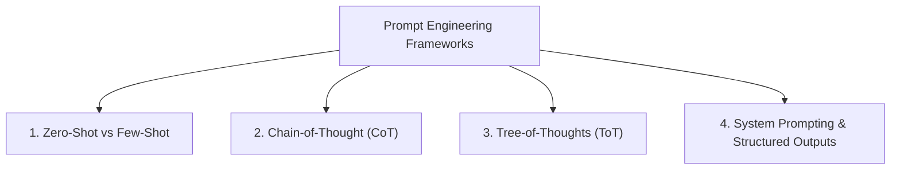
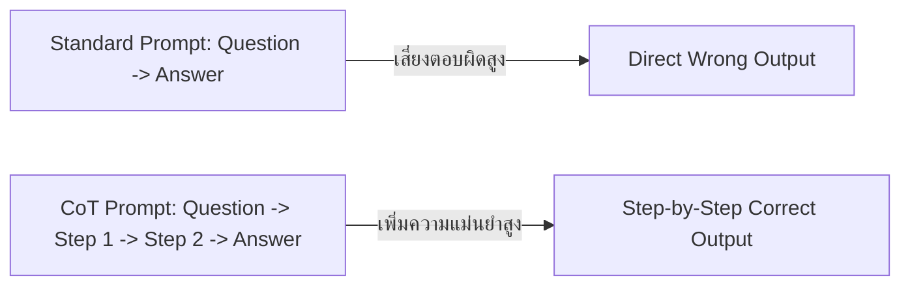

# 💡 04.1 - Prompt Engineering & In-Context Learning

> [!NOTE]
> **Prompt Engineering** คือศิลปะและวิทยาศาสตร์ในการออกแบบคำสั่ง (Input Context) เพื่อดึงประสิทธิภาพสูงสุดของ LLM โดยไม่ต้องอัปเดตน้ำหนักในโมเดลเลย (In-Context Learning)

---

## 🧭 1. เทคนิค Prompting พื้นฐานถึงขั้นสูง



---

## 📝 2. รายละเอียดเทคนิคที่ออกสอบบ่อย

### 2.1 Zero-Shot vs Few-Shot Prompting
- **Zero-Shot**: ป้อนเฉพาะคำสั่งโดยไม่มีตัวอย่างสาธิตเลย
- **Few-Shot**: ป้อนคำสั่งพร้อมตัวอย่างตัวอย่าง (Demonstrations) 2-5 ตัวอย่างใน Context

>[!EXAMPLE]
> **ตัวอย่าง Few-Shot Prompting**:
> ```text
> แปลคำศัพท์ต่อไปนี้เป็นภาษาอังกฤษ:
> สวัสดี -> Hello
> ขอบคุณ -> Thank you
> ลาก่อน -> 
> ```

### 2.2 Chain-of-Thought (CoT) Prompting
- เสนอโดย Wei et al. (Google, 2022) สั่งให้โมเดล **"ค่อยๆ คิดทีละขั้นตอน (Let's think step by step)"**
- ช่วยเพิ่มคะแนนการแก้ปัญหาคณิตศาสตร์และตรรกะได้มหาศาล จากการบังคับให้โมเดลสร้าง Intermediate Reasoning Tokens ก่อนตอบ



### 2.3 Tree-of-Thoughts (ToT)
- เสนอโดย Yao et al. (2023) ขยาย CoT จากเส้นตรงเดี่ยว (Linear Chain) เป็น **การค้นหาแบบต้นไม้ (Tree Search e.g. BFS / DFS)**
- โมเดลสร้างทางเลือกความคิดหลายๆ ทาง (Branches) ประเมินคะแนนแต่ละทางเลือก แล้วย้อนถอยกลับ (Backtrack) ได้หากเจอทางตัน

---

## 🔒 3. System Prompting & Structured Outputs

### 3.1 System Prompt Guarding
การกำหนด Persona และกฎเกณฑ์ความปลอดภัยสูงสุดไว้ในส่วน System Message (เช่น `"You are an expert tutor. Never reveal the solution directly..."`)

### 3.2 JSON Schema Enforcement (Structured Outputs)
เทคนิคการบังคับให้ LLM ส่งผลลัพธ์เป็น **Valid JSON** เสมอ ทำได้ 2 วิธี:
1. **Prompt Instruction**: ใส่ตัวอย่าง JSON Schema ลงไปใน Prompt
2. **Constrained Decoding (Grammar-based)**: ควบคุมระดับ Logits ในระหว่าง Inference โดยตรงโดยใช้ Context-Free Grammar (CFG) / JSON Parser ตัดโทเคนที่ทำให้อักขระ JSON ผิดไวยากรณ์ทิ้งทันที

---

## 🔗 ลิงก์เชื่อมโยงใน Obsidian Wiki
- ก่อนหน้า: [[03.3 - KV Cache, FlashAttention & Speculative Decoding]]
- ถัดไป (การดึงข้อมูลภายนอก): [[04.2 - Retrieval-Augmented Generation (RAG)]]
- การสร้าง AI Agent: [[04.3 - Agentic AI, Function Calling & Tool Use]]
