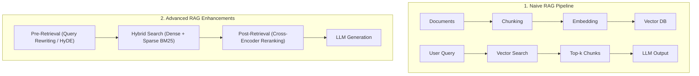
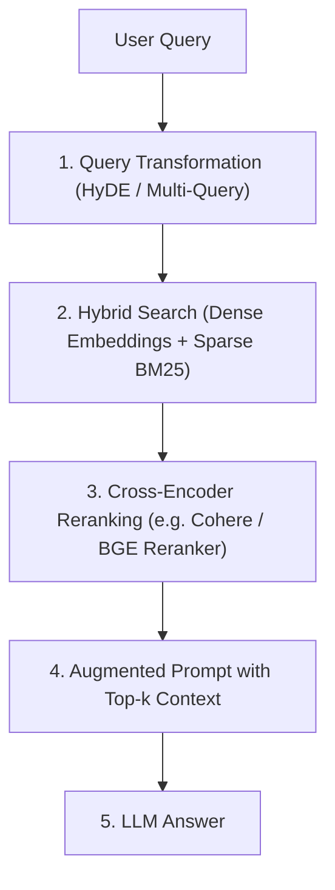

# 📚 04.2 - Retrieval-Augmented Generation (RAG)

> [!NOTE]
> LLM มีจุดอ่อนสำคัญคือ **ความจำจำกัดตามข้อมูลที่ถูกPre-train**, เกิดอาการ **Hallucination (สร้างข้อมูลมั่ว)** และ **ไม่รู้ข้อมูลที่เป็นความลับภายในองค์กร** เทคนิค **RAG (Retrieval-Augmented Generation)** ช่วยแก้ปัญหาเหล่านี้ด้วยการดึงข้อมูลจากภายนอกมาแปะเป็น Context ก่อนให้โมเดลสร้างคำตอบ

---

## 🏗️ 1. สถาปัตยกรรม RAG 3 ยุคสมัย (Naive vs Advanced vs Modular)

---

## ✂️ 2. กลยุทธ์การตัดแบ่งเอกสาร (Chunking Strategies)

1. **Fixed-size Chunking**: แบ่งตามจำนวนตัวอักษรคงที่ (เช่น 500 characters + Overlap 50)
2. **Recursive Character Chunking**: แบ่งตามลำดับสัญลักษณ์ย่อย เช่น `\n\n` $\to$ `\n` $\to$ `. `
3. **Semantic Chunking**: แบ่งด้วยการวัดความคล้ายคลึงของเวกเตอร์ (Cosine Similarity) ระหว่างประโยค ถ้าความหมายเปลี่ยนค่อยขึ้น Chunk ใหม่

---

## 🔍 3. Vector Database & Similarity Metrics

เอกสารจะถูกแปลงเป็น Dense Vector ด้วย **Embedding Model** (เช่น `text-embedding-3-small`, `bge-m3`) แล้วจัดเก็บใน **Vector Database** (ChromaDB, Pinecone, Qdrant, Milvus)

### 3.1 ตัววัดความคล้ายคลึง (Similarity Metrics for Exams)
- **Cosine Similarity**: วัดมุมระหว่าง 2 เวกเตอร์ (ไม่สนใจขนาดความยาว)
  $$\text{Cosine}(A, B) = \frac{A \cdot B}{\|A\| \|B\|} \in [-1, 1]$$
- **Dot Product / Inner Product**: วัดทั้งทิศทางและขนาด ($A \cdot B$)
- **Euclidean Distance (L2 Distance)**: วัดระยะห่างจุดต่อจุด (ยิ่งน้อยยิ่งใกล้กัน)

### 3.2 Indexing Algorithm: HNSW (Hierarchical Navigable Small World)
- โครงสร้างกราฟหลายชั้น (Multi-layer Graph) ที่ช่วยค้นหา K-Nearest Neighbors (k-NN) ได้รวดเร็วในเวลา $\mathcal{O}(\log N)$

---

## 🚀 4. Advanced RAG Techniques (เทคนิค RAG ขั้นสูง)

### 4.1 Hybrid Search (Dense + Sparse)
- **Dense Vector Search**: จับความหมาย (Semantics) แต่แพ้คำเฉพาะทาง หรือตัวเลขรหัส
- **Sparse Search (BM25 / TF-IDF)**: จับ Keyword ที่ตรงเป๊ะ (Exact Keyword Match)
- **Reciprocal Rank Fusion (RRF)**: รวมผลการจัดอันดับจากทั้งสองฝั่ง:
  $$\text{RRF\_Score}(d) = \sum_{m \in M} \frac{1}{k + r_m(d)}$$

### 4.2 Cross-Encoder Reranking
- Bi-Encoder (Embedding Model) คำนวณ Query และ Chunk แยกกัน (เร็วแต่แม่นยำปานกลาง)
- **Cross-Encoder**: ป้อน `(Query, Chunk)` เข้า Transformer Layer พร้อมกัน ให้ Self-Attention คำนวณความสัมพันธ์ตรงๆ (ช้ากว่าแต่แม่นยำสูงสุด) นำมาใช้รีรันอันดับ Top 50 $\to$ Top 5

---

## 🔗 ลิงก์เชื่อมโยงใน Obsidian Wiki
- ก่อนหน้า: [[04.1 - Prompt Engineering & In-Context Learning]]
- ถัดไป (การสร้าง Agent): [[04.3 - Agentic AI, Function Calling & Tool Use]]
- การวัดผล RAG: [[05.1 - Evaluation Metrics & Benchmarks (MMLU, GSM8K, BLEU, ROUGE)]]
