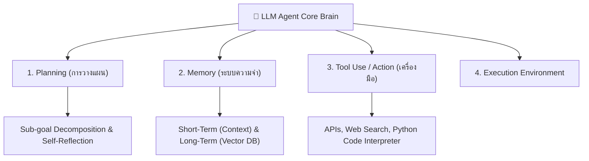
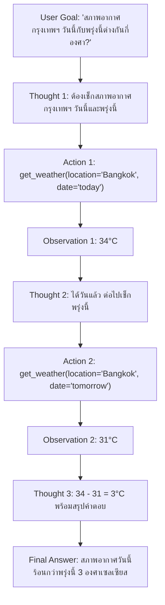
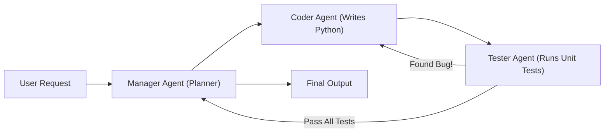

# 🤖 04.3 - Agentic AI, Function Calling & Tool Use

> [!NOTE]
> จากเดิมที่ LLM เป็นเพียงผู้ตอบคำถามแบบตั้งรับ (Passive Chatbot) **Agentic AI** ยกระดับโมเดลให้กลายเป็นระบบอัตโนมัติที่มีเป้าหมาย (Autonomous Goal-Driven Agent) สามารถวางแผน วนลูปความคิด ตัดสินใจใช้เครื่องมือภายนอก (APIs, Web Browsers, Code Executors) เพื่อทำภารกิจซับซ้อนให้สำเร็จ

---

## 🏛️ 1. สถาปัตยกรรมหลักของ AI Agent (4 Core Components)



---

## 🔄 2. กรอบความคิด ReAct (Reason + Act) Paradigm

เสนอโดย Yao et al. (2022) ผสานการ **คิดวิเคราะห์ (Thought)** เข้ากับการ **ลงมือทำ (Action)** และ **สังเกตผลลัพธ์ (Observation)** เป็นวงรอบซ้ำๆ



---

## 🛠️ 3. OpenAI Function Calling & JSON Schema

โมเดลไม่ได้รันฟังก์ชัน Python เองโดยตรง แต่จะสร้าง **JSON Object ที่ระบุชื่อฟังก์ชันและพารามิเตอร์** เพื่อส่งให้โค้ดฝั่ง Server นำไปประมวลผลต่อ

### 3.1 ตัวอย่าง JSON Schema การนิยาม Tool
```json
{
  "name": "calculate_tax",
  "description": "Calculate income tax for a given salary and country",
  "parameters": {
    "type": "object",
    "properties": {
      "income": {"type": "number", "description": "Annual salary in USD"},
      "country": {"type": "string", "enum": ["TH", "US", "JP"]}
    },
    "required": ["income", "country"]
  }
}
```

---

## 👥 4. Multi-Agent Systems (ระบบหลายเอเจนต์ทำงานร่วมกัน)

ในงานขนาดใหญ่ เช่น การพัฒนาซอฟต์แวร์ทั้งระบบ การใช้เอเจนต์เดี่ยวอาจเกิดปัญหามวลบริบทล้น (Context Overflow) จึงใช้สถาปัตยกรรม **Multi-Agent Orchestration** (เช่น CrewAI, AutoGen):



---

## 🔗 ลิงก์เชื่อมโยงใน Obsidian Wiki
- ก่อนหน้า: [[04.2 - Retrieval-Augmented Generation (RAG)]]
- ถัดไป: [[04.4 - Mixture of Experts (MoE)]]
- ปัญหาระบบความปลอดภัย Agent: [[05.2 - LLM Security, Safety & Guardrails (Prompt Injection, Jailbreak)]]
