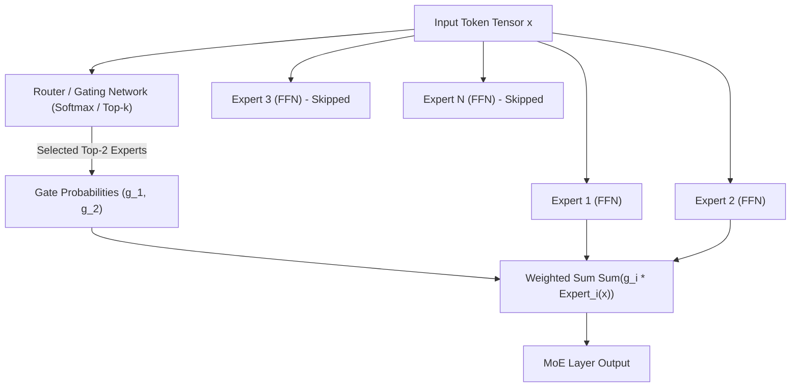
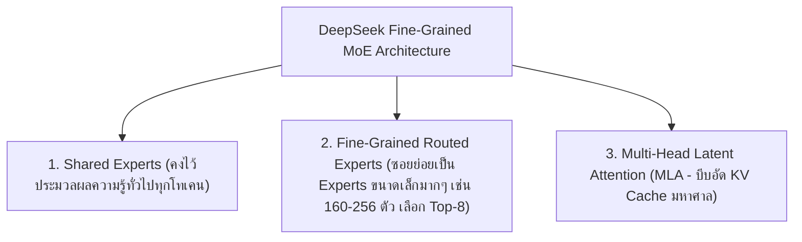

# 🔀 04.4 - Mixture of Experts (MoE)

> [!NOTE]
> ในโมเดลแบบหนาแน่น (**Dense Models** เช่น Llama-3 70B) ทุกๆ พารามิเตอร์จะถูกเปิดใช้คำนวณในทุกๆ โทเคน สถาปัตยกรรม **Mixture of Experts (MoE)** เปลี่ยนผ่านไปสู่ **Sparse Activation** โดยคัดเลือกเฉพาะ Sub-networks (Experts) บางส่วนมาประมวลผล ช่วยให้ขยายขนาดความรู้โมเดลได้ถึงระดับแสนล้านพารามิเตอร์โดยที่ยังรักษาความเร็วในการ Inference เท่าโมเดลขนาดเล็ก

---

## 🏛️ 1. โครงสร้างของ Sparse MoE Layer

สถาปัตยกรรม MoE จะนำ Layer Feed-Forward Network (FFN) ดั้งเดิมออก แล้วแทนที่ด้วย **กลุ่มของ FFN หลายๆ ตัว (Experts)** และเพิ่ม **Router / Gating Network** ไว้ด้านหน้า:

---

## 📐 2. คณิตศาสตร์ของ Router / Gating Mechanism

 Router คำนวณความเหมาะสมของแต่ละ Expert ต่อโทเคน $x$:

$$G(x) = \text{Softmax}\left( \text{TopK}(x \cdot W_g, k) \right)$$
$$y = \sum_{i \in \text{TopK}} G(x)_i \cdot E_i(x)$$

โดยที่:
- $W_g \in \mathbb{R}^{d_{\text{model}} \times E}$ คือ Weights ของ Router
- $E$ คือจำนวน Experts ทั้งหมด (เช่น 8 หรือ 64 Experts)
- $k$ คือจำนวน Experts ที่เปิดใช้งานต่อโทเคน (เช่น Top-2)

>[!EXAMPLE]
> **เปรียบเทียบคำศัพท์ข้อสอบ: Total Params vs Active Params**:
> - **Mixtral 8x7B**:
>   - **Total Parameters**: มีพารามิเตอร์รวมทั้งหมดประมาณ **47 Billion parameters**
>   - **Active Parameters per Token**: สำหรับแต่ละโทเคน Router เลือกใช้เพียง Top-2 Experts $\to$ ใช้คำนวณจริงเพียง **13 Billion parameters**!
>   - **ผลลัพธ์**: ความฉลาดระดับ 47B ในความเร็วของ 13B!

---

## ⚖️ 3. ปัญหา Expert Load Balancing & Auxiliary Loss

- **ปัญหา Token Collapse / Routing Imbalance**: Router มักเลือกใช้เฉพาะ Expert ยอดนิยมเพียง 1-2 ตัวเดิมๆ ส่งผลให้ Experts ที่เหลือไม่ได้ถูกพัฒนาความรู้ (Under-trained) และเกิดปัญหากราฟฟิกลดความเร็ว (Bottleneck)
- **การแก้ไข**: ใส่ **Auxiliary Load Balancing Loss** เข้าไปในสเต็ปการเทรน เพื่อลงโทษโมเดลหาก Router กระจายโทเคนลง Experts ไม่สม่ำเสมอ:

$$\mathcal{L}_{\text{aux}} = \alpha \cdot E \sum_{i=1}^{E} f_i \cdot P_i$$

โดยที่ $f_i$ คือสัดส่วนโทเคนที่ถูกส่งไป Expert $i$ และ $P_i$ คือความน่าจะเป็นเฉลี่ยจาก Router

---

## 🐉 4. DeepSeek MoE Architecture (DeepSeek-V2 / V3)

DeepSeek ปรับปรุงสถาปัตยกรรม MoE ไปอีกขั้นด้วย 2 นวัตกรรมปฏิวัติวงการ:

---

## 🔗 ลิงก์เชื่อมโยงใน Obsidian Wiki
- ก่อนหน้า: [[04.3 - Agentic AI, Function Calling & Tool Use]]
- โครงสร้าง FFN ดั้งเดิม: [[01.3 - Transformer Architecture Overview]]
- เข้าสู่ Module 05: [[05.1 - Evaluation Metrics & Benchmarks (MMLU, GSM8K, BLEU, ROUGE)]]
