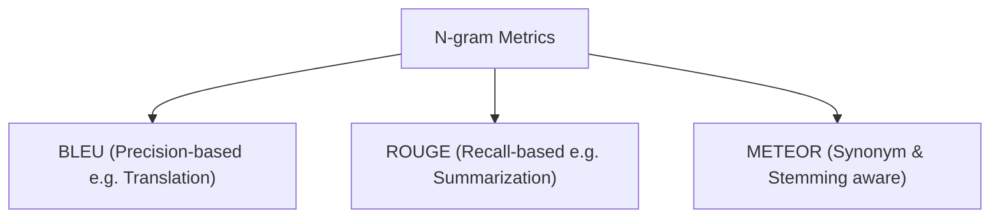
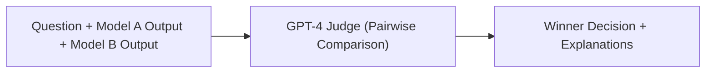

# 📊 05.1 - Evaluation Metrics & Benchmarks (MMLU, GSM8K, BLEU, ROUGE)

> [!NOTE]
> การประเมินผลประสิทธิภาพของ LLM เป็นเรื่องท้าทายอย่างมาก เนื่องจากคำตอบจากภาษาธรรมชาติเปิดกว้างและมีวิธีพูดได้หลายรูปแบบ บทนี้อธิบายตัววัดดั้งเดิม (Statistical NLP Metrics), ตัววัดโมเดลภาษา (Perplexity), มาตรฐาน Benchmarks ระดับสากล และเทคนิค **LLM-as-a-Judge**

---

## 📏 1. ตัววัดผลเชิงสถิติดั้งเดิม (Traditional N-gram Metrics)

### 1.1 BLEU (Bilingual Evaluation Understudy)
- เน้นวัดค่า **Precision** ของ N-gram ที่ตรงกับข้อความอ้างอิง (Reference):
  $$\text{BLEU} = \text{BP} \cdot \exp \left( \sum_{n=1}^{N} w_n \log p_n \right)$$
- ใส่ค่าตัวลงโทษความยาวสั้น **Brevity Penalty (BP)** เพื่อป้องกันโมเดลสร้างประโยคสั้นๆ เพื่อหลบมุมเอา Precision 100%

### 1.2 ROUGE (Recall-Oriented Understudy for Gisting Evaluation)
- เน้นวัดค่า **Recall** สำหรับงานสรุปความ (Summarization):
  - **ROUGE-1 / ROUGE-2**: วัดความตรงกันของ Unigram / Bigram
  - **ROUGE-L**: วัดจากลำดับคำย่อยร่วมกันที่ยาวที่สุด (Longest Common Subsequence - LCS)

---

## 🌀 2. Perplexity (PPL) - ตัววัดความสับสนของโมเดลภาษา

$$\text{PPL}(X) = \exp \left( -\frac{1}{N} \sum_{i=1}^{N} \log P(x_i \mid x_{<i}) \right)$$

- **นิยามเชิงแนวคิด**: Perplexity คือจำนวนคำเฉลี่ยที่โมเดลกำลัง **"ลังเล/สับสน"** ในการเลือกคำถัดไป
- **หลักการจำสำหรับสอบ**: **ยิ่งค่า Perplexity ต่ำ โมเดลยิ่งมีความแม่นยำสูงและมีความเชื่อมั่นสูง** (PPL = 1 หมายถึงโมเดลทายคำถัดไปถูก 100% โดยไม่ลังเลเลย)

---

## 🏆 3. Standard LLM Benchmarks (มาตรฐานการทดสอบสากล)

| ชื่อ Benchmark | สาขาการทดสอบ | รูปแบบข้อสอบ |
| :--- | :--- | :--- |
| **MMLU** (Massive Multitask Language Understanding) | ความรู้ทั่วไปครอบคลุม 57 สาขาวิชา (STEM, Humanities, Social Sciences) | Multiple-choice 4 ตัวเลือก |
| **GSM8K** (Grade School Math 8K) | การแก้โจทย์ปัญหาคณิตศาสตร์ระดับประถม (8,500 ข้อ) | Multi-step Reasoning CoT |
| **HumanEval** | ความสามารถในการเขียนโค้ดภาษา Python (164 ปัญหา) | รัน Pass@1 Unit Tests จริง |
| **MATH** | โจทย์คณิตศาสตร์การแข่งขันระดับมัธยมปลาย | ความคิดเชิงตรรกะระดับสูง |
| **Chatbot Arena (LMSYS)** | ความพึงพอใจของผู้ใช้จริงผ่านการแข่ง Blind A/B Test | Elo Rating System |

---

## 👩‍⚖️ 4. LLM-as-a-Judge Paradigm

ใช้โมเดลที่มีความสามารถสูงมาก (เช่น GPT-4, Claude 3.5 Sonnet) มาทำหน้าที่เป็นกรรมการตัดสินคุณภาพคำตอบของโมเดลอื่นๆ

- **ข้อดี**: รวดเร็ว ประหยัดค่าใช้จ่ายเมื่อเทียบกับการจ้างมนุษย์ (Human Evaluation)
- **ข้อระวังสำหรับสอบ (Biases in LLM Judge)**:
  1. **Position Bias**: แนวโน้มที่จะให้คะแนนคำตอบที่ปรากฏเป็นลำดับแรก (Model A) สูงกว่า
  2. **Verbosity Bias**: แนวโน้มที่จะชอบคำตอบยาวๆ อธิบายเยอะๆ แม้จะน้ำเยอะก็ตาม
  3. **Self-Enhancement Bias**: แนวโน้มที่จะเลือกคำตอบจากตระกูลโมเดลของตัวเอง

---

## 🔗 ลิงก์เชื่อมโยงใน Obsidian Wiki
- ก่อนหน้า: [[04.4 - Mixture of Experts (MoE)]]
- ด้านความปลอดภัย: [[05.2 - LLM Security, Safety & Guardrails (Prompt Injection, Jailbreak)]]
- ตะลุยโจทย์สอบ: [[05.3 - Exam Preparation Guide & Q&A Examples]]
