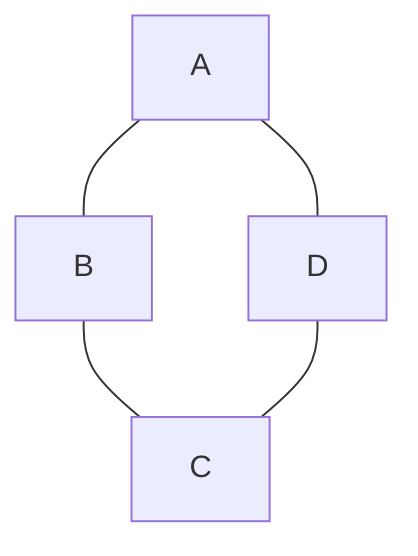
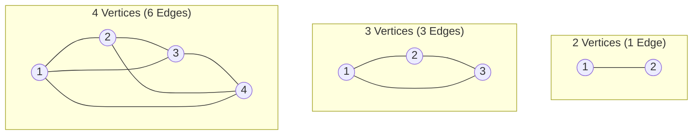
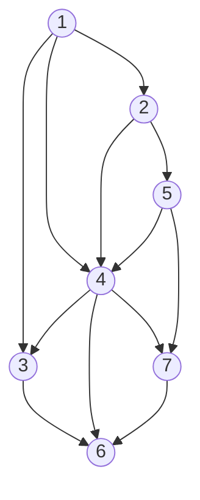

# 📚 เอกสารเฉลยละเอียดและสารานุกรมวิชาการ: Topological Sort & Graph Fundamentals (Lecture 10)

> **อ้างอิงจากเอกสารแจกในห้องเรียน**:
> - เอกสารต้นฉบับ: [`Lectures/Lecture 10 Graph/Topological sort.pdf`](./Topological%20sort.pdf)
> - เอกสารเฉลยเสร็จสมบูรณ์ (Annotated PDF): [**`Lectures/Lecture 10 Graph/Topological sort_solved.pdf`**](./Topological%20sort_solved.pdf)
> - 🌟 **ห้องทดลองเสมือนจริง (Interactive Visual Debugger)**: [**`DsaLab Studio: Lecture 10 Topological Sort`**](../../DsaLab/index.html?topic=topsort)
> - สไลด์บรรยายหลัก: [`Lectures/Lecture 10 Graph/Lecture 10 Graph.pdf`](./Lecture%2010%20Graph.pdf)
> - ผู้สอน: ดร.ประดิษฐ์ พิทักษ์เสถียรกุล (ภาควิชาเทคโนโลยีสารสนเทศ มจพ. ปราจีนบุรี)

---

## 🧭 สารบัญเนื้อหารายหน้า (Page-by-Page Index)

- [📄 หน้า 1: กราฟไม่มีทิศทาง (Undirected Graph) & กฎเหล็กการเขียน Path](#-หน้า-1-กราฟไม่มีทิศทาง-undirected-graph--กฎเหล็กการเขียน-path)
- [📄 หน้า 2: กราฟมีทิศทาง (Directed Graph) & นิยาม Adjacent](#-หน้า-2-กราฟมีทิศทาง-directed-graph--นิยาม-adjacent)
- [📄 หน้า 3: Complete Graph & สูตรคำนวณจำนวนเส้นเชื่อม](#-หน้า-3-complete-graph--สูตรคำนวณจำนวนเส้นเชื่อม)
- [📄 หน้า 4: Representation of Graph - Adjacency Matrix & การคำนวณขยะใน RAM](#-หน้า-4-representation-of-graph---adjacency-matrix--การคำนวณขยะใน-ram)
- [📄 หน้า 5: Representation of Graph - Adjacency List (DAG 7 จุดยอด)](#-หน้า-5-representation-of-graph---adjacency-list-dag-7-จุดยอด)
- [📄 หน้า 6: Topological Sort Tracing (Indegree Array & Queue Tracing)](#-หน้า-6-topological-sort-tracing-indegree-array--queue-tracing)
- [💻 โค้ดภาษา Python สมบูรณ์ (Kahn's Algorithm ด้วย Indegree Queue)](#-โค้ดภาษา-python-สมบูรณ์-kahns-algorithm-ด้วย-indegree-queue)
- [🎯 สรุปกับดักข้อสอบและจุดหักคะแนน 0 คะแนน (Zero-Score Traps)](#-สรุปกับดักข้อสอบและจุดหักคะแนน-0-คะแนน-zero-score-traps)

---

## 📄 หน้า 1: กราฟไม่มีทิศทาง (Undirected Graph) & กฎเหล็กการเขียน Path



### 1.1 โครงสร้างข้อมูลพื้นฐานของกราฟ
- **เซตของจุดยอด (Vertices / Nodes)**:
  $$V = \{A, B, C, D\} \quad (|V| = 4)$$
- **เซตของเส้นเชื่อม (Edges)**:
  $$E = \{(A, B), (B, C), (C, D), (D, A)\} \quad (|E| = 4)$$
- **ดีกรีของจุดยอด (Degree)**:
  - $\text{deg}(A) = 2$ (เชื่อมกับ $B, D$)
  - $\text{deg}(B) = 2$ (เชื่อมกับ $A, C$)
  - $\text{deg}(C) = 2$ (เชื่อมกับ $B, D$)
  - $\text{deg}(D) = 2$ (เชื่อมกับ $C, A$)
- **ทฤษฎี Handshaking Lemma**:
  $$\sum_{v \in V} \text{deg}(v) = 2|E| \implies 2 + 2 + 2 + 2 = 2(4) = 8$$

---

### 1.2 คำถามในเอกสาร & เฉลยคำตอบทางการ
> **คำถาม**: จงเขียน path จาก vertex $A$ ไป vertex $D$

#### ✅ คำตอบที่ถูกต้องสำหรับเขียนส่งอาจารย์:
$$\mathbf{A, B, C, D} \quad \text{หรือ} \quad \mathbf{A, D}$$

> [!CAUTION]
> ### ⚠️ คำเตือนจุดที่ได้ 0 คะแนนทันที (Verbatim Zero-Score Trap)
> **อาจารย์ย้ำบนกระดานตัวโต:**
> > *"อย่าเขียน $A \rightarrow B \rightarrow C \rightarrow D$ เด็ดขาด ได้ 0 คะแนน!"*
> 
> **เหตุผลทางทฤษฎี**:
> นิยามทางคณิตศาสตร์ของวิถี (Path) คือ **"ลำดับของจุดยอด (Sequence of Vertices)"** ดังนั้นต้องคั่นด้วยเครื่องหมายจุลภาค (Comma) เท่านั้น เช่น `A, B, C, D` การใส่ลูกศร `->` ถือว่าผิดนิยามสัญลักษณ์และไม่ได้รับคะแนน

---

### 1.3 นิยามสำคัญ: Connect = ต่อเนื่อง ไม่ใช่ ต่อเชื่อม

ในภาษาไทย นักศึกษามักแปลคำว่า **Connect** ว่า "ต่อเชื่อม" ทำให้เข้าใจผิดว่าต้องมีเส้น Edge ตรงเชื่อมระหว่างสองจุดเสมอ อาจารย์จึงได้นิยามไว้อย่างชัดเจน:

> **"Connect = ต่อเนื่อง ไม่ใช่ ต่อเชื่อม"**
> 
> ใน Undirected Graph กราฟจะถูกเรียกว่า **Connected (เชื่อมต่อกัน/ต่อเนื่อง)** ก็ต่อเมื่อ **"มี Path (วิถี) เชื่อมระหว่างทุกคู่ของจุดยอด"**

#### 1.3.1 ตารางการเดินทางแบบต่อเนื่องครบทุกจุดยอด (A, B, C, D):

##### 🔵 เริ่มต้นจากจุดยอด A:
| คู่ Connect | จุดยอดที่เดินทางผ่าน | ลำดับ Path ทางการ | ความยาววิถี (Length = $N-1$) | คำอธิบายความต่อเนื่อง (Connect) |
| :---: | :---: | :---: | :---: | :---|
| **$AB$** | $B$ | `A, B` | $1$ | มี Edge ตรง $(A, B)$ |
| **$AC$** | $B, C$ *(หรือ $D, C$)* | `A, B, C` *(หรือ `A, D, C`)* | $2$ | **ไม่มี Edge ตรง $(A, C)$** แต่ถือว่า **Connected (ต่อเนื่อง)** ผ่านโหนด $B$ หรือ $D$ |
| **$AD$** | $D$ *(หรือ $B, C, D$)* | `A, D` *(หรือ `A, B, C, D`)* | $1$ *(หรือ $3$)* | มีทั้ง Edge ทางตรงและวิถีอ้อม |

##### 🔵 เริ่มต้นจากจุดยอด B (ตามที่อาจารย์สั่งเพิ่มเติม):
| คู่ Connect | จุดยอดที่เดินทางผ่าน | ลำดับ Path ทางการ | ความยาววิถี (Length = $N-1$) | คำอธิบายความต่อเนื่อง (Connect) |
| :---: | :---: | :---: | :---: | :---|
| **$BA$** | $A$ | `B, A` | $1$ | มี Edge ตรง $(B, A)$ |
| **$BC$** | $C$ | `B, C` | $1$ | มี Edge ตรง $(B, C)$ |
| **$BD$** | $C, D$ *(หรือ $A, D$)* | `B, C, D` *(หรือ `B, A, D`)* | $2$ | **ไม่มี Edge ตรง $(B, D)$** แต่ถือว่า **Connected (ต่อเนื่อง)** ผ่านโหนด $C$ หรือ $A$ |

##### 🔵 เริ่มต้นจากจุดยอด C:
| คู่ Connect | จุดยอดที่เดินทางผ่าน | ลำดับ Path ทางการ | ความยาววิถี (Length = $N-1$) | คำอธิบายความต่อเนื่อง (Connect) |
| :---: | :---: | :---: | :---: | :---|
| **$CA$** | $B, A$ *(หรือ $D, A$)* | `C, B, A` *(หรือ `C, D, A`)* | $2$ | **ไม่มี Edge ตรง $(C, A)$** แต่ถือว่า **Connected (ต่อเนื่อง)** ผ่านโหนด $B$ หรือ $D$ |
| **$CB$** | $B$ | `C, B` | $1$ | มี Edge ตรง $(C, B)$ |
| **$CD$** | $D$ | `C, D` | $1$ | มี Edge ตรง $(C, D)$ |

##### 🔵 เริ่มต้นจากจุดยอด D:
| คู่ Connect | จุดยอดที่เดินทางผ่าน | ลำดับ Path ทางการ | ความยาววิถี (Length = $N-1$) | คำอธิบายความต่อเนื่อง (Connect) |
| :---: | :---: | :---: | :---: | :---|
| **$DA$** | $A$ | `D, A` | $1$ | มี Edge ตรง $(D, A)$ |
| **$DB$** | $A, B$ *(หรือ $C, B$)* | `D, A, B` *(หรือ `D, C, B`)* | $2$ | **ไม่มี Edge ตรง $(D, B)$** แต่ถือว่า **Connected (ต่อเนื่อง)** ผ่านโหนด $A$ หรือ $C$ |
| **$DC$** | $C$ | `D, C` | $1$ | มี Edge ตรง $(D, C)$ |

> [!TIP]
> **สรุปกฎ Undirected Connected Graph**:
> กราฟนี้เป็น **Connected Graph** อย่างสมบูรณ์ เนื่องจากไม่ว่าเราจะเลือกคู่จุดยอดใดๆ ในบรรดา $\{A, B, C, D\}$ ทั้ง 12 วิถี จะมีเส้นทาง Path เดินทางเชื่อมต่อถึงกันได้เสมอ (แม้จะไม่มี Edge ตรงเชื่อมถึงกันก็ตาม)

---

## 📄 หน้า 2: กราฟมีทิศทาง (Directed Graph) & นิยาม Adjacent

```mermaid
graph LR
    E["E"] -->|คู่อันดับ (E,F)| F["F"]
    F -->|เส้นเพิ่ม (F,E)| E
    F -->|คู่อันดับ (F,G)| G["G"]
    G -->|คู่อันดับ (G,H)| H["H"]
    H -->|คู่อันดับ (H,E)| E
```

### 2.1 โครงสร้างกราฟมีทิศทาง (Digraph)
- **เซตจุดยอด**: $V = \{E, F, G, H\}$
- **เซตเส้นเชื่อมมีทิศทาง**:
  $$E = \{(E, F), (F, G), (G, H), (H, E)\}$$
  และอาจารย์ได้เพิ่มเส้นเชื่อม:
  $$(F, E)$$

---

### 2.2 นิยามความหมายของ Adjacent ใน Directed Graph
> **นิยามมาตรฐาน (Slide 3)**:
> *"Vertex $w$ is adjacent to $v$ iff $(v, w) \in E$"*
> (จุดยอด $w$ จะประชิดกับ $v$ ก็ต่อเมื่อมีคู่อันดับ $(v, w)$ ชี้จาก $v$ ไปยัง $w$)

1. **พิจารณาคู่อันดับ $(E, F)$**:
   - ลูกศรพุ่งจาก $E$ ไปหา $F$
   - ดังนั้น **$F$ adjacent to $E$** เพราะมีคู่อันดับ $(E, F)$
   - แต่ **$E$ ไม่ได้ adjacent กับ $F$** เพราะไม่มีลูกศรชี้กลับจาก $F$ ไปหา $E$
2. **เมื่ออาจารย์เพิ่มเส้น $(F, E)$ บนกระดาน**:
   - เมื่อมีเส้น $(F, E)$ เพิ่มเข้ามา ลูกศรจึงวิ่งได้ทั้งสองทิศทาง
   - ส่งผลให้ **$E$ กลายเป็น adjacent to $F$** และทั้งสองจุดกลายเป็น adjacent ซึ่งกันและกัน

---

### 2.3 คำถามในเอกสาร & เฉลยคำตอบทางการ
> **คำถาม**: จงเขียนเส้นทาง (path) จากจุด $E$ ไป $G$

#### ✅ คำตอบที่ถูกต้องสำหรับเขียนส่งอาจารย์:
$$\mathbf{E, F, G}$$

> [!CAUTION]
> **คำเตือนจุดหักคะแนน 0 คะแนน**:
> - ห้ามเขียน `E -> F -> G` (ได้ 0 คะแนนทันที)
> - ต้องคั่นด้วยเครื่องหมาย Com `,` เสมอ
> - เส้นทางต้องสอดคล้องกับทิศทางของลูกศร (จาก $E \to F$ และ $F \to G$)

#### ตาราง Connect ใน Directed Graph (ครบทุกจุดยอด E, F, G, H):

##### 1) เริ่มจากจุดยอดต้นทาง E:
| รหัสเส้นทาง | จุดที่เดินทางผ่าน | Path ทางการ | ความยาว (Length) | คุณสมบัติการเชื่อมต่อ |
| :---: | :---: | :---: | :---: | :---|
| **$EF$** | $F$ | `E, F` | $1$ | มี Edge ตรง $(E, F)$ (และขากลับ $(F, E)$) |
| **$EG$** | $F, G$ | `E, F, G` | $2$ | เดินทางผ่านโหนด $F$ ตามทิศลูกศร $(E,F) \to (F,G)$ |
| **$EH$** | $F, G, H$ | `E, F, G, H` | $3$ | เดินทางผ่านโหนด $F, G$ ตามทิศลูกศร |

##### 2) เริ่มจากจุดยอดต้นทาง F:
| รหัสเส้นทาง | จุดที่เดินทางผ่าน | Path ทางการ | ความยาว (Length) | คุณสมบัติการเชื่อมต่อ |
| :---: | :---: | :---: | :---: | :---|
| **$FE$** | $E$ | `F, E` | $1$ | มี Edge ตรง $(F, E)$ ที่อาจารย์เพิ่มบนกระดาน |
| **$FG$** | $G$ | `F, G` | $1$ | มี Edge ตรง $(F, G)$ ตามโจทย์เดิม |
| **$FH$** | $G, H$ | `F, G, H` | $2$ | เดินทางผ่านโหนด $G$ ตามทิศทาง $(F,G) \to (G,H)$ |

##### 3) เริ่มจากจุดยอดต้นทาง G:
| รหัสเส้นทาง | จุดที่เดินทางผ่าน | Path ทางการ | ความยาว (Length) | คุณสมบัติการเชื่อมต่อ |
| :---: | :---: | :---: | :---: | :---|
| **$GH$** | $H$ | `G, H` | $1$ | มี Edge ตรง $(G, H)$ |
| **$GE$** | $H, E$ | `G, H, E` | $2$ | เดินทางผ่านโหนด $H$ ไปยัง $E$ ตามทิศทาง $(G,H) \to (H,E)$ |
| **$GF$** | $H, E, F$ | `G, H, E, F` | $3$ | เดินทางผ่านโหนด $H, E$ ไปยัง $F$ |

##### 4) เริ่มจากจุดยอดต้นทาง H:
| รหัสเส้นทาง | จุดที่เดินทางผ่าน | Path ทางการ | ความยาว (Length) | คุณสมบัติการเชื่อมต่อ |
| :---: | :---: | :---: | :---: | :---|
| **$HE$** | $E$ | `H, E` | $1$ | มี Edge ตรง $(H, E)$ |
| **$HF$** | $E, F$ | `H, E, F` | $2$ | เดินทางผ่านโหนด $E$ ไปยัง $F$ ตาม $(H,E) \to (E,F)$ |
| **$HG$** | $E, F, G$ | `H, E, F, G` | $3$ | เดินทางผ่านโหนด $E, F$ ไปยัง $G$ |

> [!NOTE]
> **Strongly Connected vs Weakly Connected**:
> - **Strongly Connected**: กราฟมีทิศทางที่มี Directed Path เชื่อมระหว่างทุกคู่โหนด (จากกราฟด้านบน ทุกคู่โหนดในบรรดา $\{E, F, G, H\}$ มีวิถีเดินทางถึงกันได้หมด 100% จึงเป็น **Strongly Connected Graph**)
> - **Weakly Connected**: กราฟที่เดินทางถึงกันได้เฉพาะเมื่อ "ปลดหัวลูกศรออก" ให้เป็น Undirected Graph เท่านั้น

---

## 📄 หน้า 3: Complete Graph & สูตรคำนวณจำนวนเส้นเชื่อม

**Complete Graph ($K_N$)** คือ กราฟที่ทุกคู่จุดยอดมีเส้นเชื่อมต่อถึงกันโดยตรง (Every pair of distinct vertices is connected by a unique edge)



### 3.1 ที่มาของสูตรคำนวณ Edges ใน Complete Graph
การเชื่อมต่อระหว่างคู่จุดยอดใดๆ ในกราฟ $N$ จุดยอด คือการเลือกจุดยอด 2 จุดจากทั้งหมด $N$ จุดยอดโดยไม่สนลำดับ (Combination):
$$\text{Edges} = \binom{N}{2} = \frac{N!}{2!(N - 2)!} = \frac{\mathbf{N(N - 1)}}{\mathbf{2}}$$

---

### 3.2 เฉลยการเติมคำตอบลงในช่องว่างของเอกสาร (Page 3 Verbatim Solutions)

| จำนวนจุดยอด | ข้อความโจทย์ในเอกสาร | เติมตัวเลขในช่องว่าง | แสดงวิธีทำแทนค่าสูตร $\frac{N(N-1)}{2}$ | ผลลัพธ์จำนวน Edge |
| :---: | :---| :---: | :---| :---: |
| **2 vertex** | มี edge 1 เส้น | *โจทย์ให้มา* | $\frac{2(2 - 1)}{2} = \frac{2 \times 1}{2}$ | **1 เส้น** |
| **3 vertex** | มี edge **?** เส้น | **`3`** | $\frac{3(3 - 1)}{2} = \frac{3 \times 2}{2}$ | **3 เส้น** |
| **4 vertex** | มี edge **?** เส้น | **`6`** | $\frac{4(4 - 1)}{2} = \frac{4 \times 3}{2}$ | **6 เส้น** |
| **5 vertex** | มี edge **?** เส้น | **`10`** | $\frac{5(5 - 1)}{2} = \frac{5 \times 4}{2}$ | **10 เส้น** |

---

### 3.3 โจทย์ข้อสอบคำนวณ 10 Vertices
> **คำถาม**: Complete Graph ที่มี 10 vertex ถามว่า มี edge กี่ เส้น?

#### 📝 แสดงวิธีทำละเอียด:
$$\text{จำนวนเส้นเชื่อม (Edges)} = \frac{N(N - 1)}{2}$$
แทนค่า $N = 10$:
$$\text{Edges} = \frac{10(10 - 1)}{2} = \frac{10 \times 9}{2} = \frac{90}{2} = \mathbf{45\text{ เส้น}}$$

**ตอบ: มี edge ทั้งหมด 45 เส้น**

> [!TIP]
> ### 💡 เคล็ดลับเปรียบเทียบในห้องสอบ
> 1. **Complete Graph (Undirected)**: $\frac{N(N-1)}{2}$ (เช่น 10 โหนด $\to 45$ เส้น)
> 2. **Complete Graph (Directed)**: $N(N-1)$ (ไม่ต้องหาร 2 เพราะไป-กลับคิดแยกคนละเส้น $\to 10 \times 9 = 90$ เส้น)
> 3. **Tree Graph (ต้นไม้ $N$ จุดยอด)**: จะมีเส้นเชื่อมเสมอเท่ากับ $N - 1$ เส้น (เช่น 10 โหนด $\to 9$ เส้นเท่านั้น)

---

## 📄 หน้า 4: Representation of Graph - Adjacency Matrix & การคำนวณขยะใน RAM

ตาราง Adjacency Matrix เป็นการเก็บข้อมูลกราฟด้วย 2D Array ขนาด $|V| \times |V|$ โดยที่:
- $A[u][v] = 1$ เมื่อมีเส้นเชื่อมจาก $u$ ไปยัง $v$
- $A[u][v] = 0$ เมื่อไม่มีเส้นเชื่อม

---

### 4.1 ตาราง Adjacency Matrix $7 \times 7$ ที่เติมคำตอบสมบูรณ์ (Filled 7x7 Matrix)

```
       v |  1   2   3   4   5   6   7  | Out-degree (ผลรวมแถว)
    u ---+-----------------------------+-----------------------
      1  |  0   1   1   1   0   0   0  | 3  (ไปยัง 2, 3, 4)
      2  |  0   0   0   1   1   0   0  | 2  (ไปยัง 4, 5)
      3  |  0   0   0   0   0   1   0  | 1  (ไปยัง 6)
      4  |  0   0   1   0   0   1   1  | 3  (ไปยัง 3, 6, 7)
      5  |  0   0   0   1   0   0   1  | 2  (ไปยัง 4, 7)
      6  |  0   0   0   0   0   0   0  | 0  (ไม่มีทางออก - Sink)
      7  |  0   0   0   0   0   1   0  | 1  (ไปยัง 6)
    -----+-----------------------------+-----------------------
    In-deg 0   1   2   3   1   3   2  | รวมทั้งสิ้น = 12 เส้น
```

---

### 4.2 เฉลยการคำนวณร้อยละความสูญเสียหน่วยความจำ (Memory Waste Calculations)

> **ข้อความในเอกสาร**:
> *"Adjacency Matrix ไม่นิยมใช้ เพราะ เปลืองเนื้อที่ในหน่วยความจำ"*

1. **จำนวนช่องในตารางทั้งหมด**:
   $$|V|^2 = 7 \times 7 = \mathbf{49\text{ ช่อง}}$$
2. **จำนวนช่องที่มีเส้นเชื่อม (ค่าเป็น 1)**:
   $$3 + 2 + 1 + 3 + 2 + 0 + 1 = \mathbf{12\text{ ช่อง}}$$
3. **การคำนวณร้อยละของช่องที่เป็น 1 (Used Memory Percentage)**:
   $$\frac{12}{49} \times 100\% = \mathbf{24.48\%}$$
4. **จำนวนช่องที่ไม่ได้ใช้งาน (ค่าเป็น 0 / Wasted Memory)**:
   $$49 - 12 = \mathbf{37\text{ ช่อง}}$$
5. **การคำนวณร้อยละของช่องที่เป็น 0 (Wasted Memory Percentage)**:
   $$\frac{37}{49} \times 100\% = \mathbf{75.52\%}$$

---

### 4.3 ตารางเปรียบเทียบประสิทธิภาพ: Adjacency Matrix vs Adjacency List

| คุณสมบัติ | Adjacency Matrix | Adjacency List (พระเอก) | บทวิเคราะห์ทางวิชาการ |
| :---| :---: | :---: | :---|
| **Space Complexity** | $\Theta(\|V\|^2) = 49\text{ ช่อง}$ | $\Theta(\|V\| + \|E\|) = 7 + 12 = \mathbf{19\text{ ช่อง}}$ | Adjacency List ประหยัดเนื้อที่กว่าถึง **61.22%** |
| **Check Edge $(u, v)$** | $O(1)$ (เช็กดัชนีตรง) | $O(\text{degree}(u))$ | Matrix เร็วกว่าเฉพาะกรณีเช็กการมีอยู่ของ Edge คู่ใดคู่หนึ่ง |
| **Find All Neighbors** | $O(\|V\|)$ (ต้องวนลูปทั้งแถว) | $O(\text{degree}(u))$ (อ่านตามพอยน์เตอร์) | List เร็วกว่ามาก เพราะไม่ต้องเสียเวลาตรวจช่อง 0 |
| **Topological / BFS / DFS** | $O(\|V\|^2)$ | $O(\|V\| + \|E\|)$ | การท่องกราฟด้วย List ทำงานได้เร็วกว่าอย่างมหาศาล |

---

## 📄 หน้า 5: Representation of Graph - Adjacency List (DAG 7 จุดยอด)

### 5.1 แผนภาพ DAG 7 จุดยอด (Directed Acyclic Graph)



---

### 5.2 โครงสร้าง Adjacency List ในหน่วยความจำ (Pointer-Based Linked List)

อาจารย์ให้แปลงกราฟด้านบนเป็น Adjacency List ซึ่งประกอบด้วย:
1. **Array of Head Pointers** ขนาด 7 ช่อง (ดัชนี 1 ถึง 7)
2. **Linked List Nodes** แต่ละโหนดเก็บ `(Destination Vertex, Next Pointer)` สิ้นสุดด้วยสัญลักษณ์กราวด์ $\stackrel{\perp}{=}$ (แทนค่า `NULL`)

```
Index | Header Ptr | Linked List Nodes
------+------------+--------------------------------------------
  1   |    o------>| [ 2 | o ]--> [ 4 | o ]--> [ 3 | / ] (NULL)
  2   |    o------>| [ 4 | o ]--> [ 5 | / ] (NULL)
  3   |    o------>| [ 6 | / ] (NULL)
  4   |    o------>| [ 6 | o ]--> [ 7 | o ]--> [ 3 | / ] (NULL)
  5   |    o------>| [ 4 | o ]--> [ 7 | / ] (NULL)
  6   |    / (NULL)| (ไม่มีเส้นเชื่อมออก - Dead End)
  7   |    o------>| [ 6 | / ] (NULL)
```

> [!NOTE]
> **การคำนวณการใช้หน่วยความจำ**:
> - Head Pointers: 7 ช่อง
> - List Nodes: 12 โหนด (เท่ากับจำนวน 12 Edges)
> - รวมพื้นที่: $7 + 12 = \mathbf{19\text{ ช่อง}}$

---

## 📄 หน้า 6: Topological Sort Tracing (Indegree Array & Queue Tracing)

### 6.1 ทฤษฎี Topological Sort และ Kahn's Algorithm
**Topological Sort** คือ การเรียงลำดับจุดยอดใน DAG โดยมีเงื่อนไขว่า:
> หากมีเส้นทางจาก $v_i$ ไปยัง $v_j$ แล้ว ในผลลัพธ์การเรียงลำดับ **$v_i$ จะต้องปรากฏอยู่ก่อน $v_j$ เสมอ** (ตัวอย่างคลาสสิก: ตารางวิชาบังคับก่อน / Prerequisite Courses)

#### ขั้นตอนการทำงาน (Algorithm Steps):
1. คำนวณ **Indegree** (จำนวนเส้นเชื่อมที่พุ่งเข้าหาจุดยอด) ของทุกจุดยอด
2. หาจุดยอดที่มี **$\text{Indegree} == 0$** แล้วนำเข้าคิว (`q.enqueue()`)
3. วนลูปตราบใดที่คิวไม่ว่าง:
   - นำจุดยอด $v$ ออกจากหัวคิว (`q.dequeue()`) และพิมพ์ผลลัพธ์
   - สำหรับแต่ละจุดยอด $w$ ที่เป็นเพื่อนบ้านที่ $v$ ชี้ไปหา (`for each w adjacent to v`):
     - ลดค่า $\text{Indegree}$ ของ $w$ ลง 1 (`w.indegree -= 1`)
     - หาก $\text{Indegree}$ ของ $w$ ลดลงจนเป็น 0 ให้นำ $w$ เข้าคิว (`q.enqueue(w)`)

---

### 6.2 ตาราง Indegree Array Tracing ครบทุกรอบ (Verbatim Solution Grid)

| จุดยอด ($v$) | Indegree เริ่มต้น | รอบที่ 1<br>(Pop 1) | รอบที่ 2<br>(Pop 2) | รอบที่ 3<br>(Pop 5) | รอบที่ 4<br>(Pop 4) | รอบที่ 5<br>(Pop 3) | รอบที่ 6<br>(Pop 7) | สถานะจบ<br>(Pop 6) |
| :---: | :---: | :---: | :---: | :---: | :---: | :---: | :---: | :---: |
| **1** | **0** *(เข้าคิว)* | **—** | — | — | — | — | — | — |
| **2** | 1 | **0** *(เข้าคิว)* | **—** | — | — | — | — | — |
| **3** | 2 | 1 | 1 | 1 | **0** *(เข้าคิว)* | **—** | — | — |
| **4** | 3 | 2 | 1 | **0** *(เข้าคิว)* | **—** | — | — | — |
| **5** | 1 | 1 | **0** *(เข้าคิว)* | — | — | — | — | — |
| **6** | 3 | 3 | 3 | 3 | 2 | 1 | **0** *(เข้าคิว)* | **—** |
| **7** | 2 | 2 | 2 | 1 | **0** *(เข้าคิว)* | 0 | **—** | — |

---

### 6.3 การจำลอง Array Queue State (Indices 0 ถึง 6)

โครงสร้าง Queue ที่จำลองในเอกสารหน้า 6 เป็น Circular Array ขนาด 7 ช่อง (ดัชนี 0 ถึง 6):

```
Queue Array (Array Indices 0..6):
  Index 6: [ 6 ]  <-- Enqueue ในรอบที่ 6 (Pop ออกในรอบที่ 7)
  Index 5: [ 3 ]  <-- Enqueue ในรอบที่ 4 (เมื่อ Indegree ของ 3 กลายเป็น 0)
  Index 4: [ 7 ]  <-- Enqueue ในรอบที่ 4 (เมื่อ Indegree ของ 7 กลายเป็น 0)
  Index 3: [ 4 ]  <-- Enqueue ในรอบที่ 3 (เมื่อ Indegree ของ 4 กลายเป็น 0)
  Index 2: [ 5 ]  <-- Enqueue ในรอบที่ 2 (เมื่อ Indegree ของ 5 กลายเป็น 0)
  Index 1: [ 2 ]  <-- Enqueue ในรอบที่ 1 (เมื่อ Indegree ของ 2 กลายเป็น 0)
  Index 0: [ 1 ]  <-- เริ่มต้น: Indegree เริ่มต้นเป็น 0
```

- **สถานะตัวแปรคิวเมื่อสิ้นสุดการทำงาน**:
  - `Currentsize = 0` (คิวว่างแล้วหลังนำโหนด 6 ออกมา)
  - `Front = 0` (วนรอบครบ 7 ตัว)
  - `Back = 6` (ผ่านการ Enqueue ครบทั้ง 7 ตัว)

---

### 6.4 เจาะลึกการ Trace ตัวแปร $v$ และ $w$ ในลูปทีละรอบ
- **รอบที่ 1**: Dequeue $\to v = 1$ (Output: **1**)
  - $w \in \{2, 4, 3\}$
  - ลด indegree ของ 2 เหลือ 0 $\implies$ `q.enqueue(2)`
  - ลด indegree ของ 4 เหลือ 2, ลด indegree ของ 3 เหลือ 1
- **รอบที่ 2**: Dequeue $\to v = 2$ (Output: **2**)
  - $w \in \{4, 5\}$
  - ลด indegree ของ 4 เหลือ 1
  - ลด indegree ของ 5 เหลือ 0 $\implies$ `q.enqueue(5)`
- **รอบที่ 3**: Dequeue $\to v = 5$ (Output: **5**)
  - $w \in \{4, 7\}$
  - ลด indegree ของ 4 เหลือ 0 $\implies$ `q.enqueue(4)`
  - ลด indegree ของ 7 เหลือ 1
- **รอบที่ 4**: Dequeue $\to v = 4$ (Output: **4**)
  - $w \in \{6, 7, 3\}$
  - ลด indegree ของ 6 เหลือ 2
  - ลด indegree ของ 7 เหลือ 0 $\implies$ `q.enqueue(7)`
  - ลด indegree ของ 3 เหลือ 0 $\implies$ `q.enqueue(3)`
- **รอบที่ 5**: Dequeue $\to v = 3$ (Output: **3**)
  - $w \in \{6\}$
  - ลด indegree ของ 6 เหลือ 1
- **รอบที่ 6**: Dequeue $\to v = 7$ (Output: **7**)
  - $w \in \{6\}$
  - ลด indegree ของ 6 เหลือ 0 $\implies$ `q.enqueue(6)`
- **รอบที่ 7**: Dequeue $\to v = 6$ (Output: **6**)
  - $w \in \emptyset$ (ไม่มีทางออก)
  - คิวว่าง จบการทำงาน!

---

### 6.5 คำถามในเอกสาร & เฉลยคำตอบทางการ
> **คำถาม**: จงเขียน Topological Sort ที่เป็นผลลัพธ์ จากกราฟดังกล่าว

#### ✅ คำตอบทางการสำหรับส่งอาจารย์:
$$\mathbf{1, 2, 5, 4, 3, 7, 6}$$
*(หรือหากในรอบที่ 4 มีการ Enqueue 7 ก่อน 3 จะได้ลำดับ: $\mathbf{1, 2, 5, 4, 7, 3, 6}$ ซึ่งถูกต้องตามกฎเช่นกัน)*

> [!CAUTION]
> **กฎเหล็กจุด 0 คะแนน**:
> - ห้ามเขียน `1 -> 2 -> 5 -> 4 -> 3 -> 7 -> 6` เด็ดขาด! (ได้ 0 คะแนน)
> - ต้องคั่นด้วยเครื่องหมายจุลภาค `,` เท่านั้น

---

## 💻 โค้ดภาษา Python สมบูรณ์ (Kahn's Algorithm ด้วย Indegree Queue)

```python
from collections import deque

def topological_sort(num_vertices, edges):
    """
    อัลกอริทึม Topological Sort (Kahn's Algorithm)
    Time Complexity: O(|V| + |E|)
    Space Complexity: O(|V| + |E|)
    """
    # 1. สร้าง Adjacency List และคำนวณ Indegree Array
    adj_list = {i: [] for i in range(1, num_vertices + 1)}
    indegree = {i: 0 for i in range(1, num_vertices + 1)}
    
    for u, v in edges:
        adj_list[u].append(v)
        indegree[v] += 1
        
    print(f"Indegree เริ่มต้น: {indegree}")
    
    # 2. นำโหนดที่มี Indegree == 0 เข้าคิวเริ่มต้น
    queue = deque([v for v in range(1, num_vertices + 1) if indegree[v] == 0])
    topo_order = []
    
    step = 1
    # 3. วนลูป Dequeue และลด Indegree ของเพื่อนบ้าน
    while queue:
        v = queue.popleft()
        topo_order.append(v)
        print(f"\n[รอบที่ {step}] Dequeue v = {v}")
        
        for w in adj_list[v]:
            indegree[w] -= 1
            print(f"   -> ลด indegree ของโหนด {w} เหลือ {indegree[w]}")
            if indegree[w] == 0:
                queue.append(w)
                print(f"   ✓ โหนด {w} มี indegree เป็น 0 -> Enqueue({w})")
                
        print(f"   สถานะคิวปัจจุบัน: list(queue) = {list(queue)}")
        step += 1
        
    # ตรวจสอบว่ามี Cycle หรือไม่
    if len(topo_order) != num_vertices:
        raise ValueError("กราฟมี Cycle! ไม่สามารถทำ Topological Sort ได้")
        
    return topo_order

# ทดสอบรันกับข้อมูลจริงจาก Topological sort.pdf
if __name__ == "__main__":
    edges_from_pdf = [
        (1, 2), (1, 4), (1, 3),
        (2, 4), (2, 5),
        (3, 6),
        (4, 6), (4, 7), (4, 3),
        (5, 4), (5, 7),
        (7, 6)
    ]
    
    result = topological_sort(7, edges_from_pdf)
    print("\n" + "=" * 45)
    print("✅ Official Topological Ordering Result:")
    print(", ".join(map(str, result)))
    print("=" * 45)
```

---

## 🎯 สรุปกับดักข้อสอบและจุดหักคะแนน 0 คะแนน (Zero-Score Traps)

| จุดที่มักพลาด | สิ่งที่นักศึกษาเขียนผิด (0 คะแนน) | คำตอบที่ถูกต้อง | เหตุผล |
| :---| :---: | :---: | :---|
| **การเขียน Path** | `A -> B -> C -> D` | **`A, B, C, D`** | นิยาม Path คือ Sequence of Vertices คั่นด้วย Comma ห้ามใส่ลูกศร |
| **นิยาม Connect** | เข้าใจว่าต้องมี Edge ตรงต่อเชื่อมกัน | **มี Path เดินทางถึงกันได้** | Connect แปลว่า "ต่อเนื่อง" แม้ไม่มี Edge $(A,C)$ แต่มี Path `A,B,C` ถือว่า Connect |
| **นิยาม Adjacent** | เข้าใจว่า $E$ adjacent กับ $F$ | **$F$ adjacent to $E$** | ลูกศรพุ่งจาก $E \to F$ ตัวปลายทาง ($F$) จึงเป็น adjacent ของตัวต้นทาง ($E$) |
| **สูตร Complete Graph** | ลืมหาร 2 ในกราฟไม่มีทิศทาง | $\mathbf{\frac{N(N-1)}{2}}$ | กราฟไม่มีทิศทางคู่ $(u,v)$ กับ $(v,u)$ คือเส้นเดียวกัน จึงต้องหาร 2 |
| **เขียนคำตอบ TopSort** | `1 -> 2 -> 5 -> 4...` | **`1, 2, 5, 4, 3, 7, 6`** | ห้ามใส่ลูกศรในการเขียนลำดับส่งอาจารย์ |
| **การคำนวณ RAM Matrix** | ตอบเป็นช่อง ไม่คิดเป็นร้อยละ | **24.48% (ใช้) vs 75.52% (ขยะ)** | ต้องแสดงการคำนวณเทียบฐาน 100 ช่อง ตามที่โจทย์ระบุ |

---

## 🔗 เอกสารและระบบที่เกี่ยวข้อง
- 📑 ไฟล์เฉลย PDF สมบูรณ์: [Topological sort_solved.pdf](./Topological%20sort_solved.pdf)
- 📖 สารานุกรมห้องเรียนภาพรวม: [`DSA-Wiki/13.8 - For Example Lecture 10 & 11 Graph`](../../DSA-Wiki/13%20-%20ตัวอย่างโจทย์และข้อควรระวังในห้องเรียน%20(Classroom%20For%20Example%20Tracing)/13.8%20-%20For%20Example%20Lecture%2010%20&%2011%20Graph%20(Topological%20Sort,%20BFS%20Shortest%20Path%20&%20คำนวณขยะ%20Matrix).md)
- 🚀 เครื่องมือจำลอง Interactive Debugger: [เปิด Graph BFS Shortest Path Debugger ใน DsaLab](../../DSA-Wiki/DsaLab/index.html?topic=assign4)
